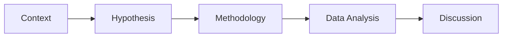

<h2 flex="~ col" mb-4>
Experimental approach to investigate the effect of information support functions against social engineering attacks
</h2>

Leopold Zhou

  
MGMT4006 Research Proposal Presentation

  <today />

<!--
Hi Nick, thanks very much for allowing me to present online
-->

---
layout: center
class: text-center
---

## You can view these slides online.

[talks.leopold.im/2023/4006-proposal/](https://talks.leopold.im/2023/4006-proposal/)

<!-- 
Since you may want to view the slides later, I have hosted them online. You can use the link here to get them.
-->

---
layout: center
class: text-center
---

## I use the following structure for this presentation

<!-- Draw the following using mermaid syntaxt:

Context -> hypothesis -> methodology -> data analysis -> discussion -->

<!-- 
Since you may want to view the slides later, I have hosted them online. You can use the link here to get them.
-->

---
layout: fact
growX: 50
growY: 0
growSize: 1.5
---

# Background
Focus of the presentation, research context, and the hypothesis

0

---
layout: center
growX: 50
growY: 0
---

# Research background

<v-clicks depth="2">

- Focus of this presentation: **Experimental Approach**...
  - ... in particular, the evaluation of the experiment design.
- Context: Social engineering attacks in information systems.

</v-clicks>

---
layout: center
growX: 50
growY: 0
---

# Based on the literature review...

<v-clicks>

- The importance of the "information" element of social engineering is widely acknowledged in the literature.
- Successful social engineering relies on effective information design, more than on the constantly changing medium of communication. 
- However, current prevention strategies related to the "information" element are limited to awareness education and do not proactively support users' decision-making processes when faced with fabricated information in information systems. 
- The less explored information systems’ own functions in mitigating social engineering attacks through fabricated information identification underscores the goal of research on the effectiveness of such functions.

</v-clicks>

---
layout: center
growX: 0
growY: 0
---

<v-clicks>

### $H_{0}$ =

## Enterprise information systems that feature **support functions** to help user **identify fabricated information** are **more resilient against social engineering attacks**.

</v-clicks>

---
layout: center
class: text-center
growX: 0
growY: 50
---

Side Note

# Why do I propose a single Hypothesis?

<!-- 
Consider the workload I have here in my Honours year - as the result of the discussion with my supervisors

Simplisticity is a virtue
-->

---
layout: fact
growX: 50
growY: 0
growSize: 1.5
---
# Learnings
On Experiment Design, from Dr. Guihyun Park

1

<!-- 
I also want to draw some learnings on this course - namely, the experiment design discussed by Dr. Park
 -->

---
layout: center
growX: 50
growY: 0
---
# Experiment Design

<v-clicks>

- A research investigation in which conditions are controlled.
- One independent variable is manipulated (sometimes more than one).
- Its effect on a dependent variable is measured.

</v-clicks>

Manipulation, comparison, and random assignment are the three key elements of an experiment.

---
layout: fact
growX: 50
growY: 0
growSize: 1.5
---
# Proposed Methodology
Controlled laboratory experiment

2

<!-- 
How I would run the experiment
-->

---
layout: center
growX: 50
growY: 0
---

<v-clicks>

I will use a **controlled laboratory experiment** to test the hypothesis.

## Participants
- A sample size of 40-50 participants (I aim to achieve: Cohen’s $d$ ~ 0.8, $α$ ~ 0.05, power level $1-β$ ~ 0.8) 
  - The sample size should be sufficient and similar to previous experiments (e.g. McFarlane 1998)
- Demographic: University students
- Reward: $10 gift card as recompense for their time (they will be informed of this before the experiment)
  - To provide a more pragmatic experience for participants (Kim, Barua, and Whinston 2002)
- I will use a Kruskal–Wallis test to evaluate and make sure no significant differences in gender, age, level of previous exposure to social engineering attacks among participants.
- Each participant should be **randomly assigned** to one of the two groups: **control** and **treatment**.
</v-clicks>

---
layout: center
growX: 50
growY: 0
---

<v-clicks>

I will use a **controlled laboratory experiment** to test the hypothesis.

## Measures
- The experiment is designed to be conducted on a standard PC (standard monitor, keyboard and mouse) to emulate a standard office operating environment.
- The simulated environment of the social engineering attack is displayed using a customised web interface written by the author.
  - The single browser running latest version of Chrome in the centre of the screen.
  - Every participant will be given the same social engineering attack (in this case the same phishing email).
  - In the treatment group, the support functions will be displayed as a dialog box as well as an AI-generated score board of information genuineness on the right side of the screen to help participants identify the fabricated information.
- The dependent variable is measured by the number of participants who fall for the social engineering attack in each group.
- The independent variable is measured by the presence of the support functions in the treatment group.

</v-clicks>

<!--
I have written the web interface for the experiment. but I will not show it here.
 -->

---
layout: center
growX: 50
growY: 0
---

<v-clicks>

I will use a **controlled laboratory experiment** to test the hypothesis.

## Procedure
- I expect to pilot-test and refine the experimental tasks and treatment conditions using 15 to 20 participants, to verify task comprehension and relevance.
- The experiment is designed to use an isolated unallocated office to remove potential environmental distractions (McFarlane 2002). 
- Participants will attend one at a time and sign a consent form before commencing. Participants were briefed on what the research involved and what would be done with their data after the experiment. 
- Participants will first do an entrance questionnaire before commencement, documenting their personal demographics, educational background, proficiency and degree of exposure to social engineering attacks.
- Participants will be given written instructions to ask them to complete the following tasks:
  1. Read the email and decide what to do next.
  2. If they click the link, they will be asked to enter their username and password.
- On finishing, participants will complete another questionnaire to record their personal preferences and comments on potential further contact.

</v-clicks>

---
layout: fact
growX: 50
growY: 0
growSize: 1.5
---
# Data Analysis
Skipped, as it's not a part of this course.

3

---
layout: fact
growX: 50
growY: 0
growSize: 1.5
---
# Discussion
Contributions to knowledge and to practice

4

---
layout: center
---
<h1 mb-2>Contributions to knowledge</h1>

<v-clicks>

- Despite much work into social enginering attacks, mostly at a technical level, very little work has focused on the cognitive side of the problem.
- My research will contribute to knowledge by providing empirical evidence on the effectiveness of information support functions in mitigating social engineering attacks through fabricated information identification.

<!--  
This research makes the major contribution to knowledge by providing empirical evidence on the effectiveness of information support functions in mitigating social engineering attacks through fabricated information identification.

-->
</v-clicks>

---
layout: center
---
<h1 mb-2>Additionally...</h1>

<v-clicks>

- The insights gained from the research will inform the development of a decision support system – which is the high-level aim of my Honours research - that can provide universal assistance for preventing social engineering attacks, regardless of the medium used for the attack.

</v-clicks>

---
layout: intro
class: text-center pb-5
growX: 50
growY: 120
---

# Thank You!
